# PandaSet Semantic Segmentation using 2DPASS model

# [2DPASS](https://github.com/yanx27/2dpass) Model
**2D Priors Assisted Semantic Segmentation on LiDAR Point Clouds**

[](https://arxiv.org/pdf/2207.04397.pdf)
[](https://github.com/yanx27/2DPASS)

**2DPASS** is introduced in the following paper

[Xu Yan*](https://yanx27.github.io/), [Jiantao Gao*](https://github.com/Gao-JT), [Chaoda Zheng*](https://github.com/Ghostish), Chao Zheng, Ruimao Zhang, Shuguang Cui, [Zhen Li*](https://mypage.cuhk.edu.cn/academics/lizhen/), "*2DPASS: 2D Priors Assisted Semantic Segmentation on LiDAR Point Clouds*", ECCV 2022 [[arxiv]](https://arxiv.org/pdf/2207.04397.pdf).

### 2DPASS Architecture
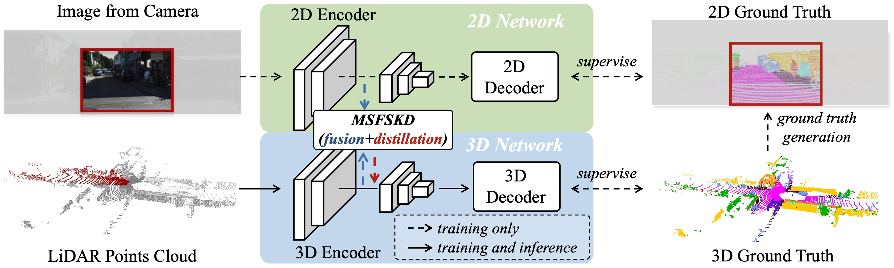


### 2DPASS Feature Generation
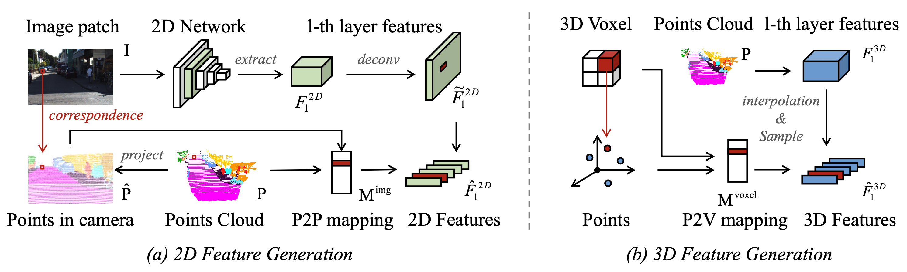

---
# [PandaSet](https://pandaset.org/) Dataset


### Download

To download the dataset, please visit the official [PandaSet](https://pandaset.org/ "Pandaset Official Website") webpage and sign up through the form.
You will then be forwarded to a page with download links to the raw data and annotations.

### Structure

```text
.
├── LICENSE.txt
├── annotations
│   ├── cuboids
│   │   ├── 00.pkl.gz
│   │   .
│   │   .
│   │   .
│   │   └── 79.pkl.gz
│   └── semseg  // Semantic Segmentation is available for specific scenes
│       ├── 00.pkl.gz
│       .
│       .
│       .
│       ├── 79.pkl.gz
│       └── classes.json
├── camera
│   ├── front_camera
│   │   ├── 00.jpg
│   │   .
│   │   .
│   │   .
│   │   ├── 79.jpg
│   │   ├── intrinsics.json
│   │   ├── poses.json
│   │   └── timestamps.json
│   ├── back_camera
│   │   └── ...
│   ├── front_left_camera
│   │   └── ...
│   ├── front_right_camera
│   │   └── ...
│   ├── left_camera
│   │   └── ...
│   └── right_camera
│       └── ...
├── lidar
│   ├── 00.pkl.gz
│   .
│   .
│   .
│   ├── 79.pkl.gz
│   ├── poses.json
│   └── timestamps.json
└── meta
    ├── gps.json
    └── timestamps.json
```

## Data Format

|     Point Cloud (Lidar)     |              Annotation               |
|:---------------------------:|:-------------------------------------:|
| 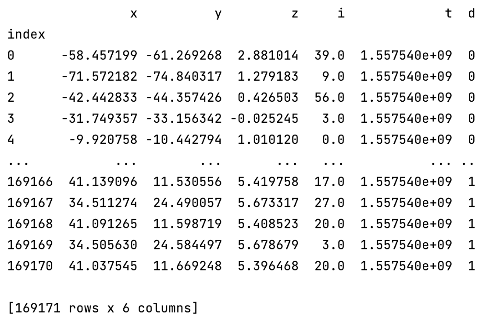 | 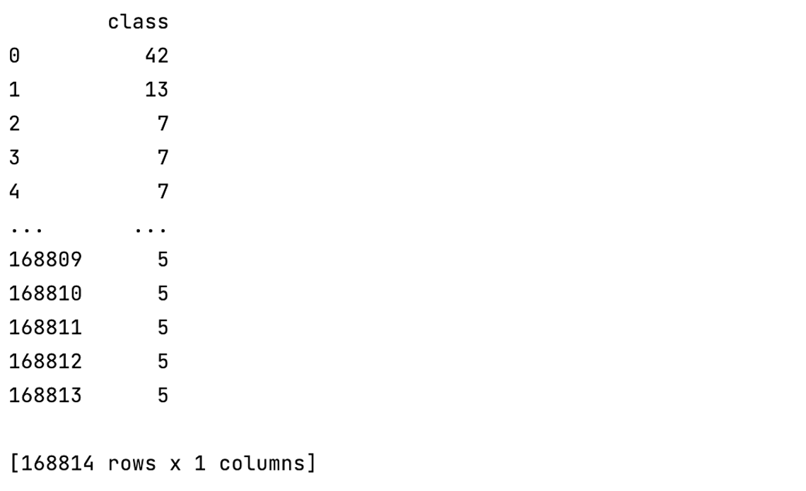 |
|      **Camera Image**       |         **Semantic Classes**          |
| 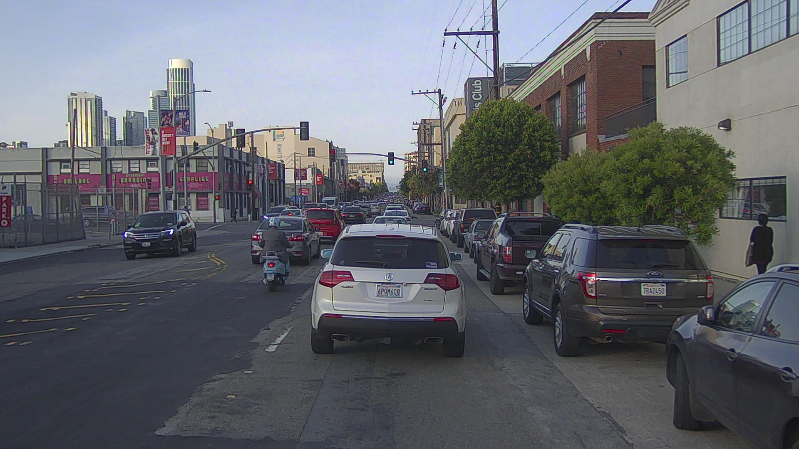 |    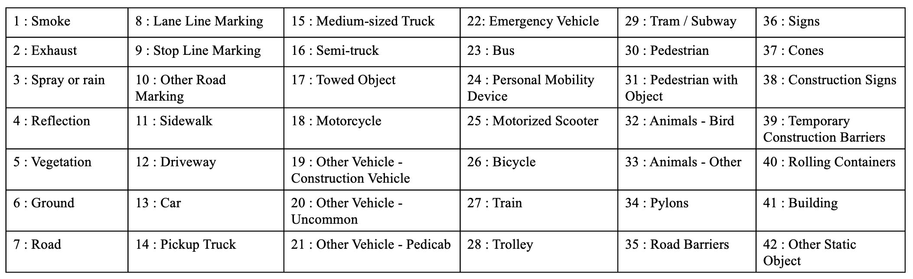    |


---
## Data Preparation

- For Training 2DPASS on PandaSet only front_camera images are considered
- Some sequences don't have semseg folder inside annotations folder as semantic segmentation is available for specific scenes
- To skip those sequences run pandaset_nosemseg.py file


## Installation

### Requirements
- python >= 3.8
- pytorch >= 1.8 
- yaml
- easydict
- pyquaternion
- [lightning](https://github.com/Lightning-AI/lightning) (tested with pytorch_lightning==1.3.8 and torchmetrics==0.5)
- [torch-scatter](https://github.com/rusty1s/pytorch_scatter) (pip install torch-scatter -f https://data.pyg.org/whl/torch-1.9.0+${CUDA}.html)
- [spconv](https://github.com/traveller59/spconv) (spconv==2.1.16 and cuda==11.1, pip install spconv-cu111==2.1.16)


## Training from scratch

You can run the training without pretrained_model
```shell script
cd <root dir of this repo>
python main.py --log_dir pandaset --gpu 0
```

## Continue Training from pretrained model
You can continue last training by loading the pretrained model
- Download the pretrained model checkpoint from [this Google drive folder](https://drive.google.com/file/d/1ykOQ7JxwCGWtSqz0NPfuUdvGL5Mawc3C/view?usp=sharing).
- Run the checkpoint/download_weight.py file to download pretrained model

```shell script
cd <root dir of this repo>
python main.py --log_dir pandaset --gpu 0 --checkpoint ./checkpoint/pretrained_model.ckpt
```

## Testing / Fine-Tuning
You can run the testing with
- Download the pretrained model checkpoint from [this Google drive folder](https://drive.google.com/file/d/1ykOQ7JxwCGWtSqz0NPfuUdvGL5Mawc3C/view?usp=sharing).
```shell script
cd <root dir of this repo>
python main.py --gpu 0 --test --num_vote 12 --checkpoint ./checkpoint/pretrained_model.ckpt
```
Here, `num_vote` is the number of views for the test-time-augmentation (TTA). We set this value to 12 as default (on a Tesla-V100 GPU), and if you use other GPUs with smaller memory, you can choose a smaller value. `num_vote=1` denotes there is no TTA used, and will cause about ~2\% performance drop.

## TensorBoard
Run the following command to open TensorBoard
```shell script
cd <root dir of this repo>
tensorboard --logdir ./logs/pandaset/ --host localhost --port 8888
```

## Charts

|            train_acc_epoch            |               val_acc                |              val_best_mIoU              |
|:-------------------------------------:|:------------------------------------:|:---------------------------------------:|
| 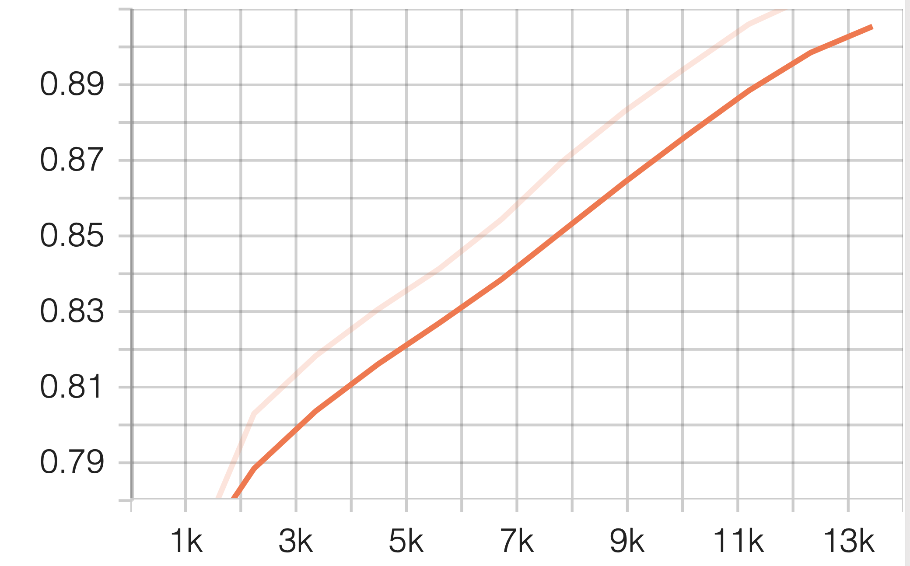 |      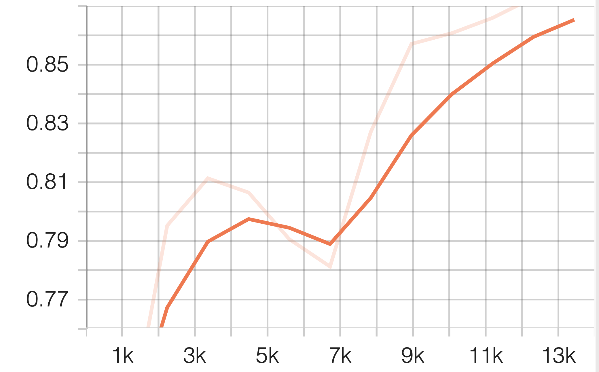       |     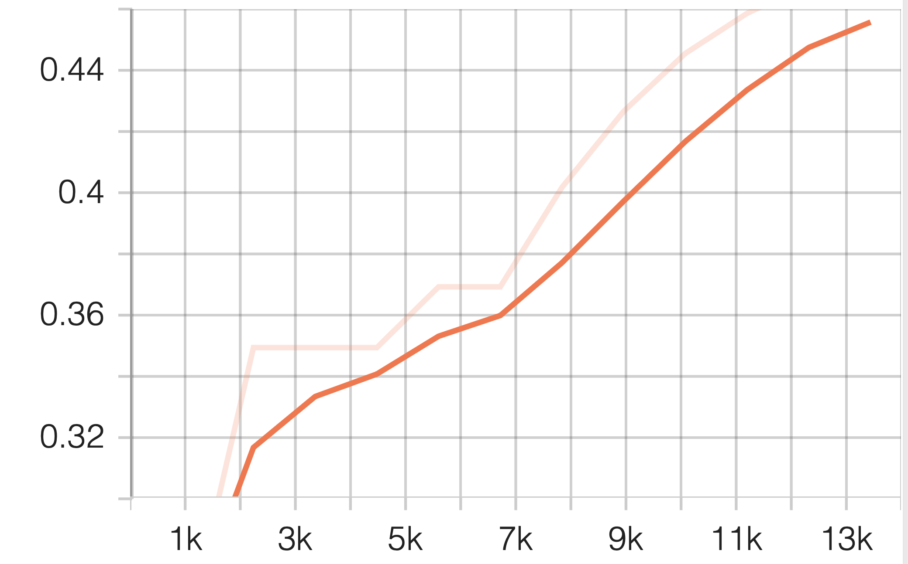     |
|          **train_acc_step**           |          **train_loss_ce**           |          **train_loss_lovasz**          |
|  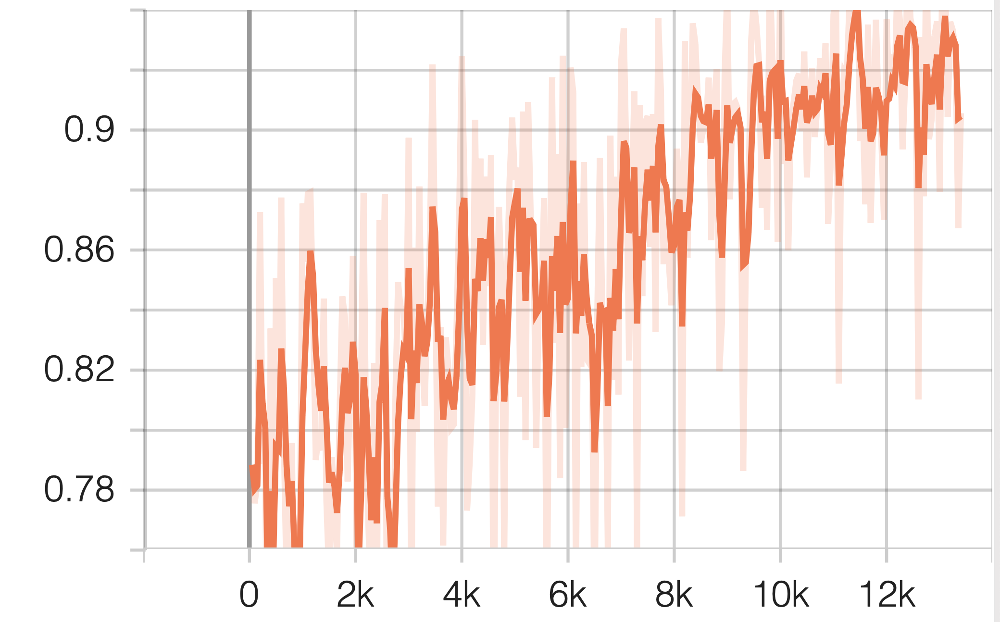  | 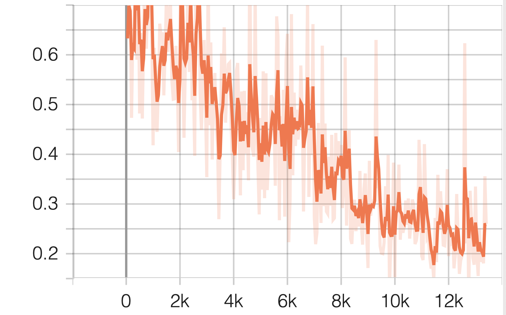 | 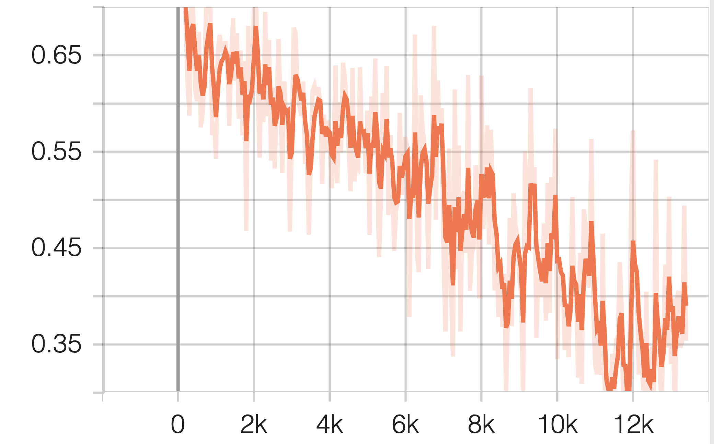 |


## Pretrained Model
You can download the models with the scores below from [this Google drive folder](https://drive.google.com/file/d/1ykOQ7JxwCGWtSqz0NPfuUdvGL5Mawc3C/view?usp=sharing).

### Test Result
After training the model for 12 epochs here is the test result

|        Class        |  IoU   |
|:-------------------:|:------:|
|        Road         | 94.07% |
|         Car         | 90.62% |
|         Bus         | 75.99% |
|       Ground        | 74.08% |
|      Building       | 71.49% |
|    Pickup Truck     | 53.68% |
|     Motorcycle      | 32.03% |
| Other Static Object | 44.20% |

|      Accuracy       |  mIoU  |
|:-------------------:|:------:|
|       45.06%        | 53.62% |

If we train the model more epochs (~60) the per class IoU and mIoU will increase. 

## Acknowledgements
- Model : [2DPASS](https://github.com/yanx27/2dpass)
- Dataset : [PandaSet](https://pandaset.org/)

